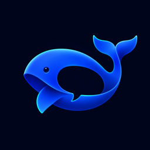
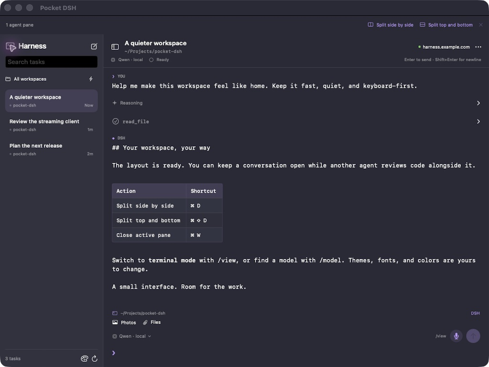
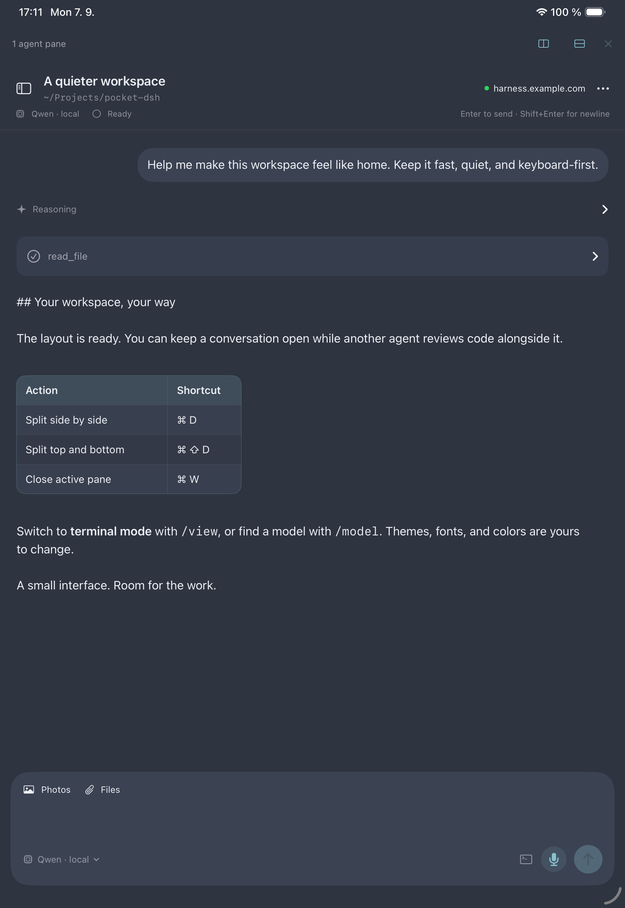
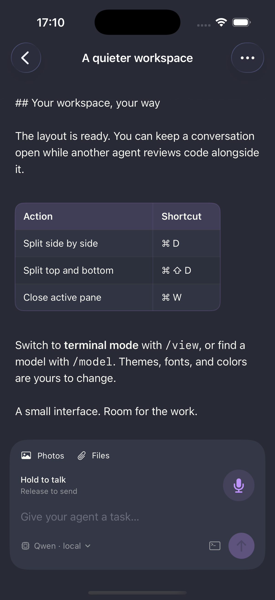

<p align="center">
  
</p>
<h1 align="center">Pocket DSH</h1>
<p align="center">Your agent. Your server. Your workspace.</p>
<p align="center">A native SwiftUI workspace for DeepSeek Harness and an experimental Swift agent engine.</p>



Pocket DSH brings your Harness sessions into a keyboard-friendly workspace. Start a task on your Mac, continue on your iPad, and check in from your phone. The agent runs on your Harness server; the client stays focused on the conversation.

## Make room for the work

- **Chat or terminal.** Switch with `/view`: a familiar conversation layout or a full-width, monospaced transcript.
- **Multiple agents on one screen.** Split panes on iPad and Mac, each with its own session. Hide the sidebar when you want more space.
- **A keyboard-first workflow.** Send with Enter, use Shift+Enter for a newline, search models with `/model`, and start in the default workspace with `/new`.
- **Readable output.** Markdown tables, code, expandable tool details, change previews, images, and collapsible reasoning. Streaming follows the bottom until you scroll away.
- **Voice and pictures.** Attach images, or hold to talk, release to send, and swipe to cancel. Voice transcription uses an optional server plugin.
- **Make it yours.** Dracula, Nord, pixel and neon themes, plus a theme editor with custom colors, typography, and JSON import/export.

<table>
<tr><td></td><td></td></tr>
<tr><td>Chat mode · Nord</td><td>iPhone · Dracula</td></tr>
</table>

Screenshots show the real app with offline demonstration data, not a live user's conversations.

## Run it

Choose a backend: an existing **DeepSeek Harness** server or the included experimental **Native Harness** host. Both connect to a separate model provider; this repository does not bundle inference weights or a model runtime. The DSH adapter started with **0.1.2-rc.1** and now also handles the separate assistant stream observed in **0.1.3-alpha.2**. This is not a claim of complete API parity across those releases.

1. Open `PocketDSH.xcodeproj` in Xcode. The source project definition is `project.yml` (regenerate with `xcodegen generate` after changing it).
2. Select the PocketDSH scheme and an iPhone/iPad simulator or **My Mac (Mac Catalyst)** destination.
3. For physical devices, copy `Config/Local.xcconfig.example` to `Config/Local.xcconfig` and set your development team. This file stays local.
4. Run the app, open **Connection**, and paste the sign-in URL supplied by your Harness server.

Use a reachable HTTPS address for remote access. A private network such as Tailscale works well; keep the sign-in token when replacing a loopback hostname. Credentials are stored in Keychain. Model API keys remain on the Harness server.

See [installation and signing](docs/INSTALL.md) for device builds and AltStore packaging, and [architecture](docs/ARCHITECTURE.md) for the code map and optional plugins.

## Native Harness preview

The included [Swift 6 host](NativeHarness/README.md) runs on macOS with system SQLite and a small C/POSIX PTY bridge. It has no external Swift package dependencies and needs no Node/Python runtime. Select **Native Harness** in Connection and supply its authenticated launch URL; the host binds to loopback, so remote clients require a separately configured secure tunnel.

- **One session, two views.** Chat and real Shell share the same ordered history, agent activity and draft. Shell Enter runs a command; ⌘Enter asks the integrated agent without switching views.
- **Persistent terminal.** Command blocks retain cwd, output and exit status. Interactive programs receive terminal input; Ctrl+C interrupts the foreground command while preserving the shell.
- **Keyboard reuse.** Tab completes commands/paths; Up/Down browse history. Fish-style history suggestions accept with Right or Option+Right. Find, copy and attach selected command output to an agent question.
- **Readable terminal output.** Theme-aware ANSI styles and bundled file symbols work in live and retained output. Optional host-side `eza` supplies `ls`, `ll`, `la` and `lt` listings.
- **Recovery and inspection.** SQLite journals reconcile output after reconnect/restart without rerunning old commands. The agent can observe a running terminal through bounded read-only tools; file edits and agent shell commands use one-use approval.

This backend is an early preview. Images, voice, model selection, full-access policy, queue/steering controls, rich diff inspection and notifications are not wired to it yet. The existing DSH backend retains its own features. Eight shells per host launch and one attached client per native session are current limits. Physical iPad verification of the new native Shell is pending. See [integration and verification](docs/NATIVE-CHAT-INTEGRATION.md).

## Keyboard shortcuts

| Action | Shortcut |
| :--- | :--- |
| Send / insert newline | Enter / Shift+Enter |
| Split side by side | ⌘D |
| Split top and bottom | ⌘⇧D |
| Move focus between panes | ⌘⌥ arrow keys |
| Maximize / restore active pane | ⌘⇧M |
| Close active pane | ⌘W |
| Choose a model | `/model` |
| Switch chat / terminal | `/view` |
| New task in default workspace | `/new` |
| Complete a slash command | Tab or Enter |

Closing a pane leaves its agent running on the server. The last pane stays open.

## Roadmap

See the [current roadmap](docs/ROADMAP.md) for the implemented/native-backend distinction, reconciliation of all 46 DSH and 55 Warp research areas, and proposed next milestones. The [original feature audit](docs/FEATURE-PARITY-AUDIT.md) preserves the earlier live Harness web-client evidence.

## Development

Build with a current Xcode SDK; the deployment target is iOS 17. Native terminal rendering uses the bundled [SwiftTerm 1.5.1 library subset](Vendor/SwiftTerm/README.md), under its [MIT license](Vendor/SwiftTerm/LICENSE). Its CLI dependencies are not required. Some scrolling and material effects use newer system APIs with fallbacks.

```sh
sh scripts/check.sh       # Offline client/core/PTY checks and mocked voice tests; Xcode + Node
sh scripts/check-native.sh # Native core and transcript/editor checks only; no Node/model needed
./scripts/build-mac.sh    # Build and verify a signed Mac Catalyst app
```

Live integration checks are opt-in and require your own Harness instance. See [contributing](CONTRIBUTING.md).

## Status and boundaries

This is an independently developed personal client, being shared as an early project. It is not affiliated with DeepSeek or Apple. The Mac version uses **Mac Catalyst**. Glass styling uses system materials where available; it does not make the entire window transparent to other applications. Reliable background push notifications are not shipped. Voice needs the optional relay and your own transcription service.

The Rust terminal client and PagerTerminal are separate projects and are not included here. The application bundles third-party [licenses and notices](Vendor/THIRD-PARTY-NOTICES.txt).
