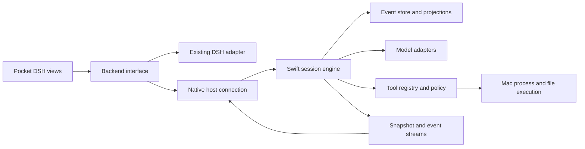

# Native Swift harness: mechanics and design research

Date: 2026-09-08. Status: source research and proposed design; no engine implementation or runtime qualification.

## Recommendation

Build a Swift engine that preserves DSH's execution semantics, with Pocket DSH as its first UI. Preserve the distinction between turns, model steps, tool calls, persistent events, and transient streaming. Do not reproduce Cordis or require JavaScript plugins to run the core.

The existing client is valuable: keep its conversation rendering, keyboard workflows, panes, attachments, and themes. Introduce a backend boundary rather than putting execution into views or replacing the application.

## Evidence and limits

The reference inspected is the installed `@deepseek-ai` **0.1.3-alpha.2** distribution. Paths in the source map below are relative to its package directory. The inspected files are distributed JavaScript, declarations, and their explanatory comments, not an independently rebuilt upstream checkout. Exact file hashes are recorded in [the source manifest](native-harness-sources.sha256).

The [upstream repository](https://github.com/deepseek-ai/deepseek-harness) describes a Cordis plugin architecture and warns of breaking changes during developer preview. Its current branch is not assumed identical to the installed release. The [upstream license](https://github.com/deepseek-ai/deepseek-harness/blob/master/LICENSE) is MIT; any actual code reuse must carry its applicable notices. This document proposes behavior and boundaries, not a wholesale source translation.

Source reading establishes implemented branches and intended contracts. It does **not** establish that recovery, concurrency, or remote reconnect are fault-free. The [acceptance scenarios](NATIVE-HARNESS-SCENARIOS.md) are future verification work, not passed tests. Earlier client feature research is separate: [feature parity audit](FEATURE-PARITY-AUDIT.md).

## Mechanics worth preserving

### 1. One session has one execution owner

`dsh-agent-loop/lib/index.js:510–729` separates idle, running, and maintenance. It reserves running state before launching asynchronous work. A wake arriving during cancellation can be latched for the next activity. Maintenance and normal execution are mutually exclusive.

A **turn** can contain several **steps**. Each step snapshots context, requests the model, records the assistant response, executes requested tools, then decides whether another step is needed. A turn-stopping extension can add more work before the turn finally closes. Completion, blocking, output limits, cancellation, and errors are different outcomes.

**Keep:** one driver per session, explicit transition rules, immutable request snapshots, and structured stop reasons. A closing window must detach a viewer, not implicitly own or terminate execution.

### 2. Queue and steering are different operations

`dsh-agent/lib/types/inbox.js` folds `agent/inbox/spliced` events into `next-turn` and `next-step` lists. At a boundary it claims all next-step messages, and at a turn boundary at most one next-turn message. Append/remove/replace are normalized splices with pending-ID validation.

In the loop, follow-up means next turn with wake; steering means next step with wake; internal injection means next step without waking an idle agent. Cancel normally clears the inbox, with an explicit preservation option.

**Keep:** separate UI commands for queue, steer, and stop. Specify queue retention on stop rather than letting an implementation accident decide. Steering does not edit an already transmitted provider request.

### 3. History and model context are different views

The session records events; model-visible context is a projected surface. Request headers capture model/provider, configuration, system prompt, and tool definitions. The loop freezes the request envelope and tracks surface replacement generations (`dsh-agent-loop/lib/index.js:839–917`).

**Keep:** original history, a context projection, and a UI projection. Summaries must not erase the user's original conversation. Record enough request provenance to explain why a model saw a given tool or setting. Do not persist credentials in that provenance.

### 4. Streaming is provisional until settled

`dsh-agent-loop/lib/index.js:739–839` uses assistant-stream attempts and revisions separately from the final `assistant/message` event. Interrupted content can be recorded with an interrupted marker. A final durable event settles the transient attempt.

**Keep:** identities for session, turn, step, request attempt, message, and revision. Retries must not append duplicate partial answers as if they were successful messages. UI rendering needs bounded updates; the engine must continue when no view is subscribed.

### 5. Tools may run concurrently, but transcript ordering stays deterministic

`dsh-agent-loop/lib/index.js:242–396` bounds parallel calls, drains them at exclusive barriers, and commits results in model-call order. A slow first call can delay committing a later result even when that later tool has completed. Tool start is recorded before dispatch. Cancellation stops new work and settles started work.

`dsh-tools/lib/types/index.js` supplies argument materialization, policy/guard stages, approval integration, and result validation. Tool behavior is more than a dictionary of closures.

**Keep:** typed tool descriptors, input/output validation, explicit parallel/exclusive classification, output limits, cancellation contracts, and ordered result commitment. For filesystem edits, validate expected old content before applying changes; a second pane may have edited the same file.

**Improve:** expose provisional per-tool progress independently so ordered history does not make completed tools look frozen. Define conflict handling across sessions, not just within one turn.

### 6. Permissions are engine policy

`dsh-user-approval/lib/types/index.js:14–166` defines `ask` and `never`; **never rejects approval-requiring actions**, it does not mean unrestricted access. Requests and decisions are logged, grants are per requested action, and missing answerers fail closed. Policy changes enter runtime context without rewriting the stable system prefix.

**Keep:** distinguish access scope, approval policy, and a one-time decision. “Full access” is a scope choice with a clear UI, not an alias for “never ask.” Bind answers to request IDs and concrete actions. An old approval arriving after cancellation must have no effect.

`dsh-sandbox-local/lib/index.js` probes platform enforcement, including `sandbox-exec` on macOS. That implementation is not evidence that our future Swift process wrapper is sandboxed. The supported enforcement/distribution strategy needs a dedicated experiment before claiming parity.

### 7. Recovery cannot promise exactly-once external effects

`dsh-session/lib/types/repair.js:1–132` closes interrupted tool/step/turn boundaries deterministically. It distinguishes a call with no recorded start from a started call with no recorded result. The latter has an **unknown outcome**; side effects must be checked before retrying.

`dsh-session-persistence-jsonl/lib/index.js` serializes writes, batches live events, holds cross-process writer ownership, repairs torn tails, and uses fsync-backed persistence paths. Logical session append and completed disk persistence are distinct moments. A buffered event is not automatically power-loss durable.

**Keep:** a writer lease/lock, ordered events, explicit persistence barriers, crash-tail recovery, and unknown-outcome status. A request ID prevents duplicate admission only within its defined contract; it cannot make an arbitrary shell command exactly-once.

### 8. Compaction is a guarded operation

`dsh-compaction-basic/lib/index.js:368–620` selects balanced boundaries that do not split tool call/result pairs, retains a recent tail, creates a summary, revalidates its selected surface, and records replacement provenance. Empty/truncated summaries are rejected in its summarizer path. Automatic thresholds and retry limits are model-aware (`:851–903`).

**Keep:** an immutable compaction input, generation checks, balanced tool pairs, retained recent context, and an atomic replacement in our store. Budget the system prompt, schemas, history, attachments, and output allowance; token estimates are estimates. Surface pressure and actual provider context-overflow errors both need handling.

**Cache:** stable prompt/schema ordering and an append-friendly prefix can support provider caching. Changing language does not eliminate prefill. Measure cold/warm provider timings independently from local engine overhead; do not promise speedups from Swift alone.

### 9. Goals and children are separate lifecycles

`dsh-goal/lib/types/index.js:243–361` separates durable goal phase from process-local continuation authority. Disarming does not rewrite phase; resuming records activation. Active, paused, blocked, and complete are distinct.

`dsh-subagent/lib/types/child-agent.js` persists lineage, delegation depth, workspace, and composition; model inheritance follows the actual route rather than blindly retaining old creation options. Its delegated scope cannot widen itself. `run-settlement.js` distinguishes one-shot job outcomes from continuable children, which are not one-shot background jobs.

**Keep:** explicit child session identities, bounded depth/concurrency, fixed delegated capabilities, and clear result delivery. Do not turn “parent finished” into an accidental orphan process. Parent cancellation, detach, resume, and independently continuing children need explicit policy.

**Stage later:** workflows, schedules, and autonomous goal continuation. They should invoke the same tested execution commands, not introduce another loop implementation. Their complete drivers were not audited here.

### 10. Reconnection is reconciliation, not just reopening a socket

`dsh-api-session-controller/lib/types/commands.js:279–330,516–529` checks prompt IDs against pending and recorded user messages. The client session implementation separates optimistic submissions, durable history repair, and transient stream baselines. `client/ordered-baseline.js` preserves visible identity order while merging authoritative rows.

**Keep:** command IDs, acceptance versus completion, an authoritative snapshot plus cursor, gap detection, and transient baseline replacement. Our proposal strengthens command admission with a transactionally stored idempotency key and payload digest. The inspected DSH checks alone are not a proof of race-free deduplication across every async admission path.

Unknown event kinds must survive decoding or produce an explicit compatibility state; silently dropping a new approval/goal event is unacceptable.

## Proposed Swift architecture

These are design recommendations, not claims about existing Pocket DSH implementation.

| Module | Responsibility | Explicit boundary |
| --- | --- | --- |
| Domain | IDs, events, commands, content blocks, errors, pure reducers | No SwiftUI or sockets |
| Engine | Session actor, transition logic, inbox, cancellation, budgets | No MainActor execution dependency |
| Store | Transactions, event sequence, command receipts, recovery, attachments | Engine is the only semantic writer |
| Providers | HTTP streaming, capabilities, usage, retry classification | No UI state; no silent model fallback |
| Tools | Schema validation, scope, approvals, scheduling, results | Host capability required for OS effects |
| Host | Lifetime, writer ownership, authentication, remote API | Survives client disconnects |
| Client | Backend adapter, snapshots, subscriptions, reconciliation | Owns display state, not agent truth |

Use one session actor, but do not mistake an actor for an entire-turn mutex. An `await` allows intervening activity; reserve state before suspension and validate the attempt/generation when results return. Cancellation is cooperative and must propagate to network and process resources. See [Swift concurrency](https://docs.swift.org/swift-book/documentation/the-swift-programming-language/concurrency/) and [Task cancellation](https://developer.apple.com/documentation/swift/task/cancel()).

Proposed store: system SQLite with an event table plus indexed projections and transactional command receipts; a narrow Swift wrapper or small Swift package is compatible with the requirement. JSONL remains an export/import format. This avoids implementing our own multi-record commit protocol, but transaction settings, recovery, attachment publication, and corruption handling still require tests. This choice is not a measured winner yet.

Store receipts with `(sessionID, commandID)` uniqueness and a payload digest. A repeated ID with different content is an error. Acknowledge accepted commands only after the specified persistence boundary. Before an effectful tool dispatch, commit its started marker. If the result cannot be committed, stop dependent execution and expose the ambiguity.

Keep disk work, JSON parsing, token accounting, and tool output processing off the main actor. Publish coalesced UI deltas with a bounded buffer; reliable state events must be replayable rather than dropped. Large outputs become artifacts with previews instead of unlimited strings in memory.

## Apple platform and dependency boundary

| Platform | Initial role |
| --- | --- |
| Mac | Swift host with local tools, file access, persistent sessions; native client connects locally |
| iPad / iPhone | Same client/domain code, remote Mac execution; local model interaction limited to permitted app capabilities |
| Home Rig | Existing model/ASR endpoint; it need not be rewritten to replace the Mac harness runtime |

Apple provides [continued background processing](https://developer.apple.com/documentation/backgroundtasks/performing-long-running-tasks-on-ios-and-ipados) for user-initiated work, including tasks lasting minutes or more, but execution is system-managed and may be queued. This is not an always-on server guarantee. Use the Mac as the initial persistent owner.

Swift/Foundation/SwiftUI, system SQLite, networking, and selected small Swift packages fit the requirement. Build-time package resolution is not an end-user npm runtime. Tools may invoke the user's project toolchain: a JavaScript project still needs its own Node environment; that does not require Node for the harness itself.

Future real terminal: evaluate [SwiftTerm](https://github.com/migueldeicaza/SwiftTerm), whose core and Apple frontends are Swift. Mac uses a host PTY; iPad displays a remote terminal. Keep terminal session lifetime separate from an agent turn. A human-controlled shell should not receive concurrent model keystrokes without explicit ownership handoff. Version, transitive dependencies, licensing notices, keyboard handling, and performance still need a bounded integration evaluation.

## What not to port initially

- Cordis dynamic service graph and every plugin lifecycle hook. Start with typed registries and explicit extension points.
- Arbitrary JavaScript/TypeScript programmatic tool calling. It conflicts with a runtime-free Swift core; retain only via an optional external compatibility service if later justified.
- All MCP server runtimes. An optional MCP client can talk to external servers; their dependencies remain external and visible.
- Full legacy storage migration and compression machinery. Start with read-only import/export and preserve originals.
- Entire workflow/scheduler ecosystem before ordinary sessions recover reliably.
- New UI, theme system, or terminal emulator from scratch.

Markdown skills are portable content, but executable helpers and assumptions about installed tools must be checked. Copying system prompts alone does not preserve tool semantics or context behavior.

## Migration and first implementation boundary

1. Introduce a client backend interface around existing `HarnessAPI.swift`, `HarnessProtocol.swift`, and `PocketStore.swift`; keep current DSH support working.
2. Build a headless Swift slice: one session, one provider route, read/edit/execute tools, approvals, queue/steer/stop, event store, recovery.
3. Attach Pocket DSH to that slice. Verify the same task on Mac and iPad, including disconnect and host restart.
4. Add compaction, provider variants, children/goals, then terminal integration using the established contracts.

The first slice must survive faults, not merely print a streamed answer. No automatic replacement of the working DSH service, existing session storage, or client defaults is part of this research.

## Remaining uncertainties before a full build plan

- Exact provider capabilities and Qwen streaming/reasoning/tool-call dialect: capture sanitized real requests and responses; no live model benchmarks were run here.
- Reliable shell process-tree cancellation and sandbox strategy on the intended macOS deployment target.
- Store transaction/durability settings and event/schema migration policy.
- Authenticated remote transport, pairing, credential rotation, and version negotiation. Tailscale is connectivity, not a substitute for the application contract.
- Complete goal continuation driver, workflow/job persistence, skill discovery precedence, prompt assembly ordering, and MCP lifecycle behavior: the reviewed boundaries identify their roles, but these systems have not received exhaustive source/behavior audits.
- Distribution choice for the Mac host and lifetime when the GUI quits; headless helper versus a retained app process needs a small lifecycle experiment.
- Performance baselines: time to first rendered token, engine overhead excluding inference, idle/active memory, disk growth, reconnect latency, and cancellation latency. No numeric improvements are claimed.

## Source map

All entries refer to the installed alpha.2 package artifacts; the manifest pins their bytes. Line numbers above are navigation aids, not upstream source line numbers.

| Package path | Evidence |
| --- | --- |
| `dsh-agent/lib/types/dispatch.js` | Non-vetoing notification dispatch versus ordered control hooks |
| `dsh-agent/lib/types/inbox.js` | Queue projection, claim and splice rules |
| `dsh-agent-loop/lib/index.js` | Driver, turn/step boundaries, tool scheduler, request snapshots |
| `dsh-session/lib/types/repair.js` | Interrupted history repair and unknown tool outcomes |
| `dsh-session-persistence-jsonl/lib/index.js` | Batched persistence, writer locking, recovery, fsync paths |
| `dsh-compaction-basic/lib/index.js` | Balanced selection, summary validation, surface replacement |
| `dsh-user-approval/lib/types/index.js` | Policy and audited decisions |
| `dsh-tools/lib/types/index.js` | Preparation, approval integration, validation |
| `dsh-sandbox-local/lib/index.js` | Platform enforcement probes |
| `dsh-llm/lib/types/retry-policy.js` | Provider retry configuration; optional plugin performs retries |
| `dsh-goal/lib/types/index.js` | Goal phase and activation separation |
| `dsh-subagent/lib/types/child-agent.js` | Child lineage, composition, depth and scope |
| `dsh-subagent/lib/types/run-settlement.js` | One-shot result and cleanup outcomes |
| `dsh-api-session-controller/lib/types/commands.js` | Prompt admission and ID checks |
| `dsh-api-session-controller/lib/types/client/sessions/session.js` | Client history/stream reconciliation |
| `dsh-api-session-controller/lib/types/client/ordered-baseline.js` | Authoritative baseline merging |
