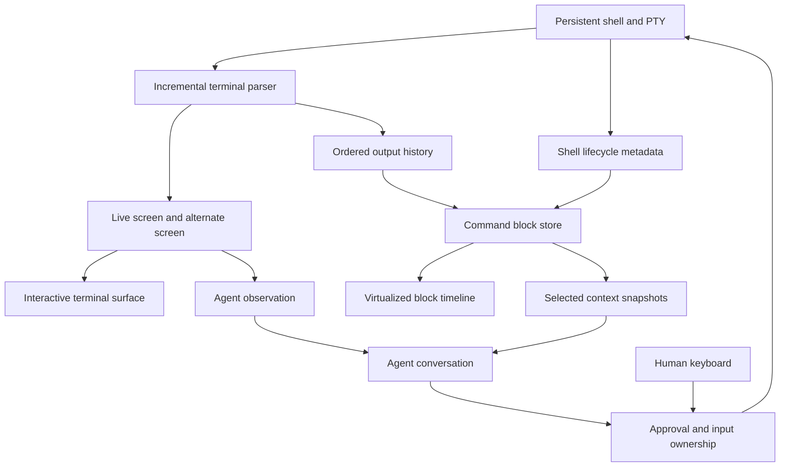

# Warp feature audit and implications for Native Harness

Date: 2026-09-08. Status: **documentation research; installed-app walkthrough blocked**.

**Current implementation status:** [the reconciled roadmap](ROADMAP.md) maps every W01–W55 area to the integrated app after the native workspace checkpoint. The earlier architecture proposals and gap tables below are historical; their statements that the bridge/emulator were uncompiled no longer describe the application. Research evidence limits remain unchanged.

**Later same-day update:** [Warp UI source study](WARP-UI-SOURCE-STUDY.md) adds a pinned public-source inspection, seven visual references, an 18-area interaction shortlist and a current integrated-client gap check. The implementation-status sections below describe the earlier research checkpoint; NativeHost, segmented Shell and the shared Pocket transcript have since been implemented. Use the new study and [current integration notes](NATIVE-CHAT-INTEGRATION.md) for present state. Installed Warp control remains blocked.

The user requested a broad Warp walkthrough before more terminal implementation, with particular attention to segmented commands. Computer Use rejected access to `dev.warp.Warp-Stable`: “Computer Use is not allowed to use the app 'dev.warp.Warp-Stable' for safety reasons.” No alternative app-control method was used. No installed Warp screens, account features, performance or successful workflows were verified. A subsequent browser-only visual pass examined the official pane-dragging video at two playback moments and three official UI images; see the visual addendum below. Other videos remain unexamined.

This document records documented capabilities and proposed architecture separately. It does not claim exhaustive live feature coverage. The accompanying [source catalog](WARP-SOURCE-CATALOG.md) indexes the official documentation snapshot, including peripheral platform features. The previous [DSH parity audit](FEATURE-PARITY-AUDIT.md) remains a separate comparison.

Implementation is paused. The initial NativeHost/NativeWire drafts remain uncompiled and unverified; they are not a completed client bridge. No SwiftTerm-based client implementation was added during this research.

## Principal finding: blocks are part of the terminal model

Warp describes a command and its output as a separately actionable block. Its historical engineering article explains shell lifecycle hooks, metadata transported from the shell, and isolated grids so later commands cannot overwrite earlier blocks. That article dates to **July 2021**: it explains the architectural principle, not a verified description of today's source. [How Warp Works](https://www.warp.dev/blog/how-warp-works).

Consequently, embedding one terminal view and drawing borders on its scrollback does not establish reliable command segmentation. Conversely, starting a new shell for every block would lose the persistent shell's working directory, variables and jobs. Our design needs **one persistent shell with structured command lifecycles**, while terminal rendering remains a separate concern. This is our design inference, not an assertion about a SwiftTerm limitation.

## Feature map

All Warp capabilities below have status **D: documented, not exercised locally**. “Candidate” indicates proposed value to our product, not an implementation commitment. Each row links its primary source; the catalog covers related pages.

### Commands, output and navigation

| ID | Documented capability | Candidate for our client |
| --- | --- | --- |
| W01 | [Command/output blocks](https://docs.warp.dev/terminal/blocks/block-basics/): individual selection, range selection, keyboard navigation, failure styling | Foundation: stable identity, lifecycle and exit status per command |
| W02 | [Block actions](https://docs.warp.dev/terminal/blocks/block-actions/): copy command, output or both; bookmarks; search and filtering entry points | Actions on a selected block, keyboard and touch |
| W03 | [Find](https://docs.warp.dev/terminal/blocks/find/): search terminal output with block scope | Locate results without changing the underlying output |
| W04 | [Filtering](https://docs.warp.dev/terminal/blocks/block-filtering/): text, regex, case, inversion and surrounding lines | Reversible view filtering; preserve complete captured data |
| W05 | [Sticky command header](https://docs.warp.dev/terminal/blocks/sticky-command-header/): identify the command while scrolling its output | Keep command identity visible for long logs |
| W06 | [Background blocks](https://docs.warp.dev/terminal/blocks/background-blocks/): collect output between foreground commands without inventing an associated command | Explicit unassigned-output blocks |
| W07 | [Sharing](https://docs.warp.dev/terminal/blocks/block-sharing/): formatted command/output permalinks | Start with local copy/export; publishing is a separate action |
| W08 | [Block appearance](https://docs.warp.dev/terminal/appearance/blocks-behavior/): compact spacing and optional dividers | Independent density and theme settings |
| W09 | [Full-screen applications](https://docs.warp.dev/terminal/more-features/full-screen-apps/): alternate-screen padding, mouse/scroll reporting, Kitty keyboard protocol | Dedicated interactive surface for Vim/top; compatibility testing required |
| W10 | [Text selection](https://docs.warp.dev/terminal/more-features/text-selection/): smart and rectangular selection | Differentiate selected text, selected blocks and input focus |

**Background limitation:** Warp explicitly says concurrent foreground/background output can mix, and multiple background producers cannot always be distinguished. A PTY read is not a process-labelled stdout event. Our UI must not assign false process provenance. [Background blocks](https://docs.warp.dev/terminal/blocks/background-blocks/).

### Input and keyboard workflow

| ID | Documented capability | Candidate |
| --- | --- | --- |
| W11 | [Modern editing](https://docs.warp.dev/terminal/editor/): cursor placement, multiline editing, word selection, wrapping, clipboard and paired characters | Native editor separate from PTY input; preserve normal Mac/iPad editing |
| W12 | [Vim editing](https://docs.warp.dev/terminal/editor/vim/) | Optional keymap, not the only usable input mode |
| W13 | [Alias expansion](https://docs.warp.dev/terminal/editor/alias-expansion/) | Show what a command expands to without losing the original draft |
| W14 | [Command inspector](https://docs.warp.dev/terminal/editor/command-inspector/) and [highlighting](https://docs.warp.dev/terminal/editor/syntax-error-highlighting/) | Explain arguments and identify syntax problems before execution |
| W15 | [History](https://docs.warp.dev/terminal/entry/command-history/) and [command search](https://docs.warp.dev/terminal/entry/command-search/) | Searchable reusable commands, distinguished from agent conversations |
| W16 | [Completions](https://docs.warp.dev/terminal/command-completions/) and autosuggestions | Fast local suggestions; do not invoke inference for each keystroke |
| W17 | [Corrections](https://docs.warp.dev/terminal/entry/command-corrections/) | Offer correction visibly; never silently rewrite a submitted command |
| W18 | [Synchronized inputs](https://docs.warp.dev/terminal/entry/synchronized-inputs/) | Optional later feature with unmistakable multi-target state |
| W19 | [YAML workflows](https://docs.warp.dev/terminal/entry/yaml-workflows/) | Parameterized saved commands |
| W20 | [Command palette](https://docs.warp.dev/terminal/command-palette/) | One action catalog for menus, shortcuts and slash discovery |
| W21 | [Classic Input](https://docs.warp.dev/terminal/input/classic-input/) versus [current modes](https://docs.warp.dev/agents/local-agents/interacting-with-agents/terminal-and-agent-modes/) | Explicit shell/chat modes; don't copy legacy and current defaults indiscriminately |

### Agent woven into the terminal

| ID | Documented capability | Candidate |
| --- | --- | --- |
| W22 | [Terminal/agent modes](https://docs.warp.dev/agents/local-agents/interacting-with-agents/terminal-and-agent-modes/): minimal shell and dedicated conversation, Command+Enter entry, optional input auto-detection | Keep Enter=shell and explicit agent submission by default |
| W23 | [Blocks as context](https://docs.warp.dev/agents/local-agents/agent-context/blocks-as-context/): select prior blocks, pending attachments, conversation-scoped commands | Immutable attachment snapshot with visible block identity |
| W24 | [Context catalog](https://docs.warp.dev/agents/local-agents/agent-context/): selections, files via @, images, URLs | Show exactly what is attached before submission |
| W25 | [Full Terminal Use](https://docs.warp.dev/agents/capabilities/full-terminal-use/): join an already running interactive program, observe and act | Agent must see both live screen state and incremental output |
| W26 | [Takeover and handback](https://docs.warp.dev/agents/capabilities/full-terminal-use/): user can stop agent writes while leaving the shell open | Explicit keyboard ownership independent of process lifetime |
| W27 | [Profiles and permissions](https://docs.warp.dev/agents/capabilities/agent-profiles-permissions/): per-profile model, tools and autonomy; shell-write policies | Keyboard-operable approval UI, scoped authority, visible active profile |
| W28 | [Queueing](https://docs.warp.dev/agents/local-agents/interacting-with-agents/prompt-queueing/): edit/reorder/remove pending prompts, sequential delivery and queue-vs-steer controls | Preserve existing durable queue; expose its real state |
| W29 | [Forking](https://docs.warp.dev/agents/local-agents/interacting-with-agents/conversation-forking/) and [slash commands](https://docs.warp.dev/agents/capabilities/slash-commands/): forks, compaction, model and conversation actions | Schema-backed discoverable commands |
| W30 | [Agent questions](https://docs.warp.dev/agents/local-agents/interacting-with-agents/agent-questions/): option cards, multiple answers/questions and skip | Inline accessible decision UI |
| W31 | [Planning](https://docs.warp.dev/agents/capabilities/planning/) and [task lists](https://docs.warp.dev/agents/capabilities/task-lists/) | Visible plan/progress events, not text scraped from output |
| W32 | [Rules](https://docs.warp.dev/agents/capabilities/rules/), [skills](https://docs.warp.dev/agents/capabilities/skills/), [MCP](https://docs.warp.dev/agents/capabilities/mcp/) | Extensible tool/context layer independent of terminal renderer |
| W33 | [Model choice](https://docs.warp.dev/agents/inference/model-choice/) and [custom endpoints](https://docs.warp.dev/agents/inference/custom-inference-endpoint/) | Preserve direct Home Rig inference; endpoint locality must remain explicit |
| W34 | [Voice](https://docs.warp.dev/agents/local-agents/interacting-with-agents/voice/) and image context | Reuse existing client affordances where compatible |
| W35 | [Agent notifications](https://docs.warp.dev/agents/capabilities/agent-notifications/) | Completion and attention as distinct events |
| W36 | [Third-party CLI agents](https://docs.warp.dev/agents/cli-agents/overview/): integration for Claude Code, Codex and OpenCode; rich toolbelt | Later integration; avoid conflating our harness with embedded foreign harnesses |
| W37 | [Codebase context](https://docs.warp.dev/agents/capabilities/codebase-context/), browser/computer use and web search | Separate capability areas, not prerequisites for command blocks |
| W38 | [Agent Memory](https://docs.warp.dev/agents/agent-memory/) | Research-preview feature; no assumption it is available to this account |

**Important product difference:** Warp's documented custom endpoint flow routes through its backend and requires a publicly reachable endpoint. That is not our intended direct connection to Home Rig over the private network. We should borrow interaction ideas without adopting that inference topology. [Custom inference endpoint](https://docs.warp.dev/agents/inference/custom-inference-endpoint/).

### Workspace, code, appearance and collaboration

| ID | Documented capability | Candidate |
| --- | --- | --- |
| W39 | [Split panes](https://docs.warp.dev/terminal/windows/split-panes/): right/down splits, active-pane close, maximize, directional navigation and drag/drop | Retain our pane tree; add explicit shell/conversation identity per pane |
| W40 | [Tabs](https://docs.warp.dev/terminal/windows/tabs/): reorder, reopen, colors, groups, pins and moving between windows | Gradual extension of existing keyboard-first workspace |
| W41 | [Vertical tabs](https://docs.warp.dev/terminal/windows/vertical-tabs/) | Compact sidebar alternative |
| W42 | [Tab configs](https://docs.warp.dev/terminal/windows/tab-configs/) | Saved workspace layouts; legacy launch configs tracked separately |
| W43 | [Session navigation](https://docs.warp.dev/terminal/sessions/session-navigation/) and [restoration](https://docs.warp.dev/terminal/sessions/session-restoration/) | Layout/history restoration must not imply recovery of a dead process |
| W44 | [Global hotkey](https://docs.warp.dev/terminal/windows/global-hotkey/) and [toolbar](https://docs.warp.dev/terminal/windows/configurable-toolbar/) | Quick summon on Mac, minimal configurable controls |
| W45 | [SSH](https://docs.warp.dev/terminal/warpify/ssh/) and [subshell integration](https://docs.warp.dev/terminal/warpify/subshells/) | Track integration support explicitly; raw fallback when absent |
| W46 | [Code editor](https://docs.warp.dev/code/code-editor/), file tree, find/replace, LSP, Vim mode | Distinct optional surface; don't grow a full IDE before shell usability |
| W47 | [Code review](https://docs.warp.dev/code/code-review/): local/branch diffs, hunk context, edits/reverts and comments to agents | Readable diff preview first; mutations and target branch explicit |
| W48 | [Git worktrees](https://docs.warp.dev/code/git-worktrees/) and [SSH feature coverage](https://docs.warp.dev/code/ssh-feature-support/) | Separate workspace identity and host-local paths |
| W49 | [Appearance](https://docs.warp.dev/terminal/appearance/): themes, custom palettes, fonts, cursor, prompt/input position, opacity/blur, pane dimming and block density | Reuse our theme system; don't couple styling to terminal parsing |
| W50 | [Settings files](https://docs.warp.dev/terminal/settings/) and settings sync (Beta) | Versioned portable settings; secrets handled separately |
| W51 | [More terminal features](https://docs.warp.dev/terminal/more-features/): links/files, Markdown viewer, working directory, accessibility, bell, notifications, quit warning and URI entry points | Small daily-use improvements after core correctness |
| W52 | [Warp Drive](https://docs.warp.dev/knowledge-and-collaboration/warp-drive/): notebooks, workflows, prompts, environment variables, folders, agent context and sharing | Local reusable library first |
| W53 | [Session sharing](https://docs.warp.dev/knowledge-and-collaboration/session-sharing/) and team administration | Explicit collaboration scope; not proof of universal shared keyboard control |
| W54 | [Cloud agents](https://docs.warp.dev/platform/): remote runs, environments, triggers, schedules, orchestration and run observability | Peripheral inventory; no requirement to reproduce cloud infrastructure |
| W55 | [Factories](https://docs.warp.dev/factories/): coordinated specialized agents and workflow infrastructure | Early Access; outside our immediate local harness objective |

## Architecture proposal — not implemented

The key boundary is **session / command block / screen / conversation**, rather than “one terminal widget versus many widgets.”

Proposed responsibilities:

1. **Shell integration:** command start/end and prompt-ready events; command text, working directory and exit code. Never infer completion from a quiet output stream or a prompt-shaped string. Start with zsh; unsupported shells remain usable in raw mode.
2. **Block store:** stable block/session IDs, lifecycle, origin (human/agent/unassigned), byte ranges and terminal-state representation. PTY exit is distinct from command exit. Completed blocks do not get overwritten by later cursor movement.
3. **Parser/emulator:** preserve state across split UTF-8/ANSI chunks, cursor movement, carriage returns, alternate-screen entry/exit, resize and terminal modes. Plain decoded text is only a preview.
4. **Presentation:** one virtualized timeline, a native input editor, and an interactive terminal surface when needed. Avoid thousands of live terminal views or shells for historical blocks. Freeze completed output while retaining copy/search information.
5. **Agent context:** deliberate immutable block attachments; bounded live reads and current screen snapshots. Record what was actually sent, including truncation and gaps.
6. **Input ownership:** human, agent or no writer; approval and takeover independently controlled. A revoked agent action cannot write late. Taking over does not close the shell. Shell output must never confer permission to itself.
7. **Transport:** monotonic sequence/cursor, replay boundary, gap detection and snapshot-plus-live ordering. Preserve host/session identity across reconnect. Fix the draft bridge's attach race before connecting a UI.
8. **Scroll/focus:** follow output only when attached to the bottom; browsing history suspends follow. Return-to-bottom resumes follow. Selecting/copying output must not be interrupted by stolen keyboard focus. These are our desired semantics, not verified Warp behavior.

**SwiftTerm decision remains open.** It can be evaluated for emulation and the interactive surface. We have not verified that its public API exposes the block/grid lifecycle, reflow and screen snapshots we need. A reusable emulator must fit the structured model; its default scroll view must not become our entire product architecture.

## Gap against the current Native Harness

Checked against the local source and existing project documentation; this is not a new runtime validation.

| Area | Current evidence | Required next investigation |
| --- | --- | --- |
| Persistent PTY | `PTYSession.swift`; prior PTY probes recorded in project docs | Preserve it, not one process per visual block |
| Incremental observation | `TerminalObservation.swift`: bounded bytes/cursors/gaps/waits and PTY exit | Add command lifecycles and a meaningful live screen representation |
| Finite command blocks | Existing ShellRunner/TerminalSession | Do not confuse finite subprocess capture with segmentation of persistent interactive shell |
| Terminal rendering | CLI forwards raw bytes to its parent terminal | Native embedded rendering and block isolation remain unresolved |
| Agent keyboard authority | Existing observation is read-only | Design takeover, approvals, revocation and stale-write handling |
| Durable history | SQLite session events; bounded in-memory PTY observation | Decide separate retention/replay policy for terminal blocks |
| Native host bridge | Draft `NativeHost.swift` and shared wire types | Paused, uncompiled; ordered snapshot/live attach still needs design |
| Pocket interface | Existing chat/terminal presentation, panes and input | Existing terminal-themed chat is not a real segmented PTY frontend |

## Live walkthrough still required

Every row below is **NOT RUN in Warp**. Use a throwaway directory and harmless commands when app access becomes available. Do not change the user's real shell configuration or account settings to manufacture a successful demo.

| Scenario | Evidence to record |
| --- | --- |
| `pwd`, directory change, variable assignment, then read it | Same shell state across distinct blocks; displayed cwd |
| Output without final newline; exit success/failure | Correct command boundaries and status |
| Carriage-return progress and cursor-up output | In-place updates do not overwrite previous blocks |
| Long log; search/filter/bookmark/copy; selection over several blocks | Keyboard paths, clipboard result, sticky header, retained full output |
| Background writer while another command runs | Placement and clearly documented mixed-output limitations |
| `read`, Python REPL, `vim`, `top` | Input routing, alternate screen, resize, return to shell |
| Ctrl+C in a running command versus empty editor versus agent | Which action stops; shell survives appropriately |
| Type multiline Unicode; select words/lines; undo/paste | macOS and external iPad keyboard expectations |
| Attach one/two blocks, change selection, send, reopen conversation | Pending versus committed context and origin visibility |
| Agent joins a human-started command; approve, take over, hand back | Who can type, how revocation behaves, process continuity |
| Queue, edit/reorder/cancel, steer while command active | Difference between human-started and agent-started long-running commands |
| Split, maximize, switch, drag, close active pane, restore tab | Focus, shell lifetime and shortcuts |
| Browse older output while streaming, return to bottom | Follow indicator, focus behavior and scroll position |
| Reopen app; reconnect SSH; interrupt transport | Restored history versus actual process liveness |
| Theme/density/input-position changes, large output | Readability and measured UI responsiveness |
| Code diff, selection as context, review comments | Exact branch, selected content and target agent |

Record build version, account/feature availability, screenshots, exact input, observed result and failures. Video references live on the linked official pages; they still need visual examination. Documentation coverage does not close this checklist.

## Suggested next decision

Review this block model before implementing the client bridge. The smallest useful follow-up is a bounded experiment: one persistent zsh, three independently selectable blocks, correct output with no trailing newline, an in-place progress display, a Vim round trip, and a controlled agent takeover. That experiment should settle emulator/API fit before transport and UI architecture harden. This is a proposal; implementation has not resumed.

## Visual addendum — 2026-09-08

Evidence: browser-rendered official media, not control of installed Warp. No downloaded media or local-app access workaround. Images may depict different releases; do not treat them as a single verified current build.

- [Pane dragging video](https://docs.warp.dev/assets/terminal/split-panes-dragging-demo.mp4): observed two playback moments showing a dragged pane header over a split target and a subsequent two-pane arrangement with separate contents. This is visual evidence of the demo, not a personally executed drag or an end-to-end playback review.
- [Terminal input image](https://docs.warp.dev/_astro/terminal-modality.D5yPuhbT_Z2p9RLG.webp): command metadata above output, thin horizontal separators, compact bottom editor with cwd/branch chips and an agent shortcut hint. Actions sit at the right edge of a block.
- [Agent conversation image](https://docs.warp.dev/_astro/agent-modality-conversation-view.Dg5PWVz0_YQ0ez.webp): prose and reasoning rows coexist with a command-detail block; failed output has restrained colored emphasis. The pending command approval displays the actual command and keyboard-labelled actions.
- [Agent monitoring image](https://docs.warp.dev/_astro/full-terminal-use-dev-monitor.DwZYeczz_1R0Kxt.webp): running server output remains visible alongside an agent response. A status strip identifies monitoring; Hide responses, Take over and stop controls appear near the bottom of the running-command area. Behavior behind these controls was not exercised.

### User requirement clarified after the initial audit

One window must support arbitrarily mixed chat and real-terminal panes. Users should be able to split in either direction, navigate, maximize and close the active pane through both visible UI and keyboard/command interfaces. Switching presentation must not silently restart a shell or destroy a conversation. Performance and immediate feedback are acceptance criteria, not consequences assumed merely from choosing Swift.

### Proposed first integrated interaction slice

1. Chat left, persistent shell right; either pane can split again horizontally or vertically.
2. One action registry backs buttons, command palette, configurable shortcuts and command dispatch. Terminal management commands need an explicit namespace so they do not intercept valid shell input or slash-containing paths.
3. Preserve Command+D / Command+Shift+D for splits and Command+W for active-pane close. Provide directional navigation and maximize with visible focus. Define last-pane behavior before implementing it.
4. Enter runs shell input; Command+Enter sends an explicit agent request with visible selected context. While a TUI owns input, terminal key encoding and application shortcuts require a clear routing policy.
5. Close a pane separately from terminating its process; active-process behavior must be explicit. Navigation and presentation changes retain session identity, draft and scroll state.
6. Validate this slice with real shell state, segmented output, a Vim round trip and streaming chat before adding broad customization or IDE features.

This is a proposed next slice, not an implemented change. The installed-app walkthrough remains blocked by Computer Use policy.
